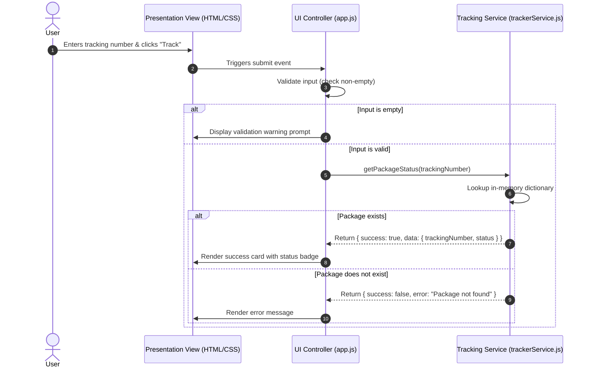

# Architecture Design: Package Delivery Status Tracker

- **Upstream Source:** [requirements.md](requirements.md)
- **Status:** Pending Design Review

---

## 1. System Overview & Architectural Rationale

The Package Delivery Status Tracker is a lightweight, client-side web application built with vanilla HTML5, CSS3, and JavaScript (ES6+). The architecture adopts a modular single-page application (SPA) design pattern with distinct separation of concerns:

- **Presentation Layer:** Semantic HTML5 and responsive CSS3 for UI layout and styling.
- **Controller/Interaction Layer:** DOM event listeners and view controllers managing state transitions and view rendering.
- **Data & Service Layer:** A standalone mock service encapsulating delivery status data and query operations.

This architecture satisfies the requirements for simplicity, rapid execution, zero external runtime dependencies, and high maintainability.

---

## 2. Component Breakdown & Responsibilities

```
+-------------------------------------------------------------+
|                      User Browser                           |
|                                                             |
|  +-------------------------------------------------------+  |
|  | Presentation View (HTML5 / CSS3)                      |  |
|  | - Input Form (Tracking Input + Submit Button)          |  |
|  | - Result Card (Status Badge, Tracking #)              |  |
|  | - Error Alert Panel                                   |  |
|  +---------------------------^---------------------------+  |
|                              | Events / DOM Updates         |
|  +---------------------------v---------------------------+  |
|  | UI Controller (app.js)                                |  |
|  | - Handles form submission & input validation          |  |
|  | - Triggers lookup requests                            |  |
|  | - Updates DOM with success / error states             |  |
|  +---------------------------^---------------------------+  |
|                              | Service Calls                |
|  +---------------------------v---------------------------+  |
|  | Tracking Service (trackerService.js)                  |  |
|  | - Encapsulates in-memory package repository          |  |
|  | - getPackageStatus(trackingNumber) method              |  |
|  | - Returns status result or NOT_FOUND error            |  |
|  +-------------------------------------------------------+  |
+-------------------------------------------------------------+
```

### Component Details

1. **Presentation View (`index.html`, `styles.css`)**
   - Renders the header, tracking search form, result container, and feedback notifications.
   - Provides visual status indicators (badges/colors corresponding to `Order Received`, `In Transit`, `Out for Delivery`, `Delivered`).

2. **UI Controller (`app.js`)**
   - Attaches event listeners to input elements.
   - Validates input format (non-empty, trims whitespace).
   - Coordinates with `trackerService.js` to execute queries.
   - Updates UI state (clearing previous results, toggling visibility between results and error panels).

3. **Tracking Service & Mock Data Store (`trackerService.js`)**
   - Holds an in-memory dictionary of sample packages.
   - Exposes public query method: `getPackageStatus(trackingNumber: string): { success: boolean, data?: PackageInfo, error?: string }`.
   - Normalizes search keys (case-insensitive lookup, trimming).

---

## 3. Data Model & Schema

```json
{
  "trackingNumber": "string (e.g., 'PKG-1001')",
  "status": "string ('Order Received' | 'In Transit' | 'Out for Delivery' | 'Delivered')"
}
```

### Seed / Mock Dataset Specification

| Tracking Number | Status |
|---|---|
| `PKG-1001` | `Order Received` |
| `PKG-1002` | `In Transit` |
| `PKG-1003` | `Out for Delivery` |
| `PKG-1004` | `Delivered` |

---

## 4. End-to-End Data Flow



---

## 5. Technology Decisions & Trade-Offs

| Decision | Chosen Option | Alternative Considered | Rationale / Trade-Off |
|---|---|---|---|
| **Runtime Environment** | Pure Client-Side (Vanilla JS) | Node.js / Express REST API | Keeps execution self-contained, zero-dependency, and immediately executable in any browser without server setup. |
| **State / Data Storage** | In-Memory Object / Map | LocalStorage / IndexedDB / SQLite | Perfectly satisfies mock data requirement; eliminates asynchronous storage complexity while keeping data reset predictable. |
| **Script Loading & Compatibility** | UMD / Dual Export Pattern (Browser + Node) | Strict ES Modules (`type="module"`) | Enables zero-config local execution via `file://` protocol and allows native Node.js test execution without bundlers. |
| **DOM Security & a11y** | `textContent` + ARIA Live Regions | `innerHTML` & non-annotated containers | Prevents XSS injection vectors and ensures screen-reader accessibility for real-time status updates. |
| **Search Matching** | Case-insensitive & trimmed (`.toUpperCase().trim()`) | Strict exact string match | Enhances user experience without violating the simple tracking number format constraint. |

---

## 6. Open Questions & Risks for Design Review

1. **Module Loading Strategy:** Should the scripts use standard ES modules (`type="module"`) or classic global namespace scripts to ensure seamless local file execution via `file://` protocol?
2. **Accessibility (a11y):** Should ARIA live regions (`aria-live="polite"`) be added to the result/error display for screen-reader accessibility?
3. **Automated Testing Strategy:** How will unit tests for `trackerService` and DOM interactions be structured without introducing heavy build tooling?
